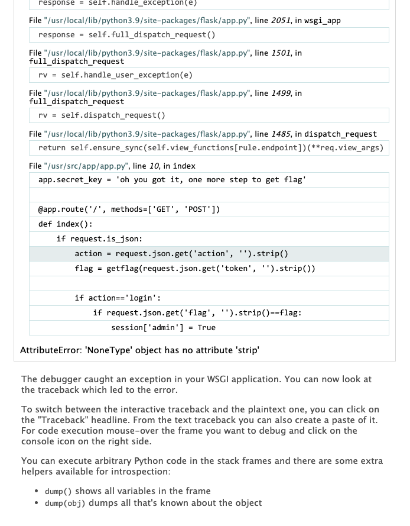

# 第零届北京大学信息安全综合能力竞赛·2021

## 目录

### Misc

- [x] [→签到← check-in](###→签到←)
- [x] [主的替代品 replace-main](###主的替代品)
- [x] [小北问答1202 xiaobei-1202](###小北问答1202)
- [x] [与佛论禅网大会员 zen](###与佛论禅网大会员)
- [x] [2038年的银行 bank-2038](###2038年的银行)

### Web

- [x] [人类行为研究实验 human-experiment](###人类行为研究实验)
- [x] [人生苦短 life-is-too-short](###人生苦短)
- [x] [千年讲堂的方形轮子 square-wheel](###千年讲堂的方形轮子)

### Binary

- [ ] 皮浪的解码器 pyrrho-decoder
- [x] [弗拉梅尔的宝石商店 flamel-gem-store](###弗拉梅尔的宝石商店)
- [x] [未来的机器 future-machine](###未来的机器)
- [ ] 庄子的回文 chuang-tzu-palindrome
- [ ] ←签退→ check-out

### Algorithm

- [x] [无法预料的回答 unpredictable-answers](###无法预料的回答)
- [ ] 安全的密钥交换 safe-key-swap
- [x] [计算概论B introduction-to-computing-b](###计算概论B)
- [ ] 巴别压缩包 babel-compression

## 题解

### →签到←

Base64解码后尝试用凯撒密码解密，实验几次后即得到flag。

### 主的替代品

需要输出的`main`可以很容易地拆分，但是入口`main`函数较难处理。

这里可以利用宏拼接来实现。具体见代码。

```c
#include <stdio.h>
#include <stdlib.h>
#define PPCAT_NX(A, B) A ## B
#define PPCAT(A, B) PPCAT_NX(A, B)
#define T1 m
#define T2 ain() 

int PPCAT(T1, T2) {
  printf("m");
  printf("a");
  printf("i");
  printf("n");
  exit(0);
}
```

### 小北问答1202

1. [北京大学网络服务-机房上机](https://its.pku.edu.cn/pcroom.jsp)提供了所有机房的房间号，计算得到数字后，利用[整数分解工具](https://zh.numberempire.com/numberfactorizer.php)进行质因数分解即可。
2. 参见[非官方课程测评@北京大学](https://courses.pinzhixiaoyuan.com/)首页。
3. 根据[RFC-7168](https://datatracker.ietf.org/doc/html/rfc7168)可以得到答案。
4. 猜的。
5. 从[IBM Support](https://www.ibm.com/support/pages/ibm-fastt-management-suite-java-msj-diagnostic-and-configuration-utility-microsoft-windows-2000-windows-nt-40-and-novell-netware-fibre-channel-solutions)下载到`90p4957.txt`文件，其中说明了默认密码。
6. 根据[marshou的博客-汉信码(Hanxin Code)与QR码(QR Code)的终极对决](https://blog.csdn.net/marshou/article/details/79623752)查到汉信码的最小尺寸，从而计算出对应的像素数，
7. 参考[简书-SM2国密算法/椭圆曲线密码学ECC之数学原理](https://www.jianshu.com/p/5b04b66a55a1)的第一节。
8. 利用[Wayback Machine](https://web.archive.org)可以查到ICANN在2013年5月4日公布的顶级域名信息的[缓存](https://web.archive.org/web/20150908164312/http://stats.research.icann.org/dns/tld_report/archive/20130504.000101.html)。

### 与佛论禅网大会员

用`binwalk`分析发现gif文件的最后拼接了一个压缩包，包含两个文本文件`flag1.txt`和`flag2.txt`。打开`flag1.txt`得到flag1（`flag{K33p_going!Passw0rd-is-hidden-in-the-1mage}`）；`flag2.txt`是加密的，结合flag1的提示，需要在图中寻找压缩包的密码。

提取出gif文件的每一帧（一共8帧），利用`stegsolve`工具，发现第2、4、6、8帧的`blue-0`（或`red-0`/`green-0`）通道各包含二维码的一部分。将这几部分按照缺口朝外的方式拼起来，并补充上三个定位点，得到的二维码如下图所示：


扫码得到`flag2.txt`的密码，解压后即得到flag2。

### 2038年的银行

第一天，利用借款上限为最大存款额十倍这一条件，在三个银行之间周转，最后三个银行的最大借款额都为20亿，买上足够的面包，剩余钱存入银行。

因为借款利率更高，借款会首先溢出有符号整型范围；同时注意适当取款，避免存款溢出。这样若干天之后，当资金足够还清借款时，一次性还清借款。

最后如果金额不够，再等几天利息即可。

### 人类行为研究实验

查看网页源代码`maximum.js`，发现`get(won)`函数中的地址`target`可以直接利用`TOKEN`生成，访问这一地址即可得到第一个flag。

继续浏览源代码，发现`submit`函数中的跳转地址可以直接利用`TOKEN`生成，访问这一地址会跳转到一个类似IAAA登陆的页面，随意输入学号和密码后即可登陆。登陆后提示身份为学生，观察此时浏览器地址，发现参数中包含`jwt`，尝试解析这一JWT，发现payload字段的内容为`{"identity": "student"}`，将`student`改为`teacher`，用得到的JWT代替原来的JWT，访问对应地址即可得到第二个flag。

### 人生苦短

分析源码可知该服务采用了客户端session的方案；另一方面，`POST /logout`之后会在Cookies中得到session，解码后得到`{'admin':false}`。因此只要能够获取到`secret_token`，然后伪造一个`{'admin':true}`的session即可。

继续分析源码，发现`request.json.get(...).strip()`对于非`str`类型会出错，尝试错误调用后，发现`Werkzeug`是以开发模式运行，在程序出错时会返回调试页面，其中会包含出错的那一行前后的若干行。特别地，如果请求中`action`字段不是字符串，程序会在第10行出错，此时返回的错误信息中恰好包含了`secret_token`所在的那一行，如下图所示。



得到`secret_token`后，即可利用`flask-unsign`库伪造session，之后调用`POST /getflag`即可得到flag。这里还有个小坑，就是`token`需要用自己的比赛token，否则生成的flag无法通过核验。

### 千年讲堂的方形轮子

首先尝试暴力篡改密文，根据反馈信息的变化，确定明文的形式为`stuid=...|name=...|flag=False|code=...|timestamp=...`。

第一问CBC，可以使用位反转攻击，将`name`设置为10位，这样保证`name`串和`flag`串（包括前面的分隔符）不在同一个块内。之后通过修改`name`串，将`False`变换为`True|`即可。

要得到最后的奖品，还需要求得`code`。通过篡改密文破坏`code`串前的分隔符，即可看到`code`的全部内容。

第二问ECB，因为加密是对每个块分别进行的，所以可以交换块的位置。这里将`name`设置为`|flag=True`，这时`name`串所在的块恰好为`|name=|flag=True`，将这个块移至第四位，然后暴力修改下一个块，尝试将下一位的明文变为`|`，这样就保证了最后的`flag`是`True`。

另一方面，我们还需要求`code`。这里直接将`code`串所在的块移至第二位，也即在`stuid`串之后，就可以从`stuid`字段读到`code`。这样就可以得到第二个flag了。

### 弗拉梅尔的宝石商店

首先下载`.pyc`文件，用[decompyle](https://github.com/rocky/python-decompile3)反编译，可以基本还原出源代码（`check_transaction`和`perform_transaction`两个函数无法准确识别），在此基础上修改调整（[代码](./flamel-gem-store/game.py)），以使得本地运行结果与服务器端运行结果基本一致。

从代码逻辑中发现以下三个关键点：

1. 用于存储交易事务的临时文件的文件名是固定的
2. `check_transaction`成功后，在`perform_transaction`阶段并不是使用`check_transaction`得到的`transaction`清单，而是重新读取了文件内容，并且在执行交易时不会再进行合法性检查
3. 卖出时，先执行`player.gain_money`后执行`player.take_commodity`，并且在`take_commodity`失败时并不会回滚`gain_money`操作

由此整理出最后的破解逻辑：

1. 同时开启两个连接
2. 在第一个连接中进行一次合法操作，比如`trade\njade 1\nEND`，但先不要确认；此时在另一个连接中执行`trade\nflag -2\nEND`，并确认。第二个连接中的交易会失败，之后再确认第一个连接中的交易，会提示`no enough commodity`，但是由于前面说的第三个漏洞，钱已经到账，此时账户上有`180500`元。
3. 在第一个连接中进行一次合法操作，比如`trade\njade 1\nEND`，但先不要确认；此时在另一个连接中执行`trade\nflag 1\nEND`，并确认。第二个连接中的交易会失败，之后再确认第一个连接中的交易。之后`inspect`即可看到已经成功购买到了flag，描述信息中即为本题所需要提交的flag。

### 未来的机器

首先理清Python代码的逻辑：

1. 初始化。读入代码。处理得到IF_TABLE（用于处理if语句）和LABEL（用于循环等跳转）。GLOBAL[18]到GLOBAL[21]设置初值。默认key被装入MEMORY[5400+4i]。默认key的长度放置在MEMORY[4986]。
2. 读入flag。MEMORY[4982]设置为flag的长度。MEMORY[5000+4i]设置为flag的内容。这个过程中，如果MEMORY长度不够，会自动补齐。
3. 逐行执行程序。至此Python脚本的功能分析完毕。

接下来，阅读ASM代码（看起来非常像`.wat`文件），并逐行翻译：

> 下面的代码中包含了一些注释和额外的信息输出。

```rust
fn run() -> i32 {
    let mut local = [0; 10000];
    let mut global = [0; 10000];
    let mut memory = [0; 10000];

    global[18] = 4982;
    global[19] = 5400;
    global[20] = 4986;
    global[21] = 5000;
    local[111] = 114514;

    let key = String::from(".q~03QKLNSp\"s6AQtEW<=MNv9(ZMYntg2N9hSe5=k");
    for (i, c) in key.chars().enumerate() {
        memory[5400 + 4 * i] = c as u8 as i32;
    }
    memory[4986] = key.len() as i32;

    let flag = String::from(".q~03QKLNSp\"s6AQtEW<=MNv9(ZMYntg2N9hSe5=k");
    for (i, c) in flag.chars().enumerate() {
        memory[5000 + 4 * i] = c as u8 as i32;
    }
    memory[4982] = flag.len() as i32;

    // Loop 96 times, set memory[1952 + 4i] to i.
    println!("Start loop:, i = {}", memory[3776]);
    loop {
        local[1] = memory[3776];
        local[23] = if local[1] < 96 { 1 } else { 0 };
        if local[23] == 0 {
            break;
        }
        local[34] = memory[3776];
        local[45] = memory[3776];
        local[56] = (local[45] << 2) + 1952;
        memory[local[56] as usize] = local[34]; // memory[1952 + 4i] = i;
        local[67] = memory[3776];
        local[78] = local[67] + 1;
        memory[3776] = local[78];
    }
    println!("End loop:, i = {}", memory[3776]);

    memory[3776] = 1;

    // Loop 96 times
    println!("Start loop:, i = {}", memory[3776]);
    loop {
        local[89] = memory[3776];
        local[100] = if local[89] < 96 { 1 } else { 0 };
        if local[100] == 0 {
            break;
        }
        local[2] = local[111];
        local[13] = local[2] * 1919;
        local[15] = local[13] + 7;
        local[16] = (local[15] % 334363) & (-1);
        local[111] = local[16];
        local[17] = local[111];
        local[18] = memory[3776];
        local[19] = (local[17] % local[18]) & (-1);
        local[113] = local[19];
        local[20] = local[113];
        local[21] = (local[20] << 2) + 1952;
        local[22] = memory[local[21] as usize];
        local[114] = local[22];
        local[24] = memory[3776];
        local[25] = (local[24] << 2) + 1952;
        local[26] = memory[local[25] as usize];
        local[27] = local[113];
        local[28] = (local[27] << 2) + 1952;
        memory[local[28] as usize] = local[26];
        local[29] = local[114];
        local[30] = memory[3776];
        local[31] = (local[30] << 2) + 1952;
        memory[local[31] as usize] = local[29];
        local[32] = memory[3776];
        local[33] = local[32] + 1;
        memory[3776] = local[33];
    }
    println!("End loop:, i = {}", memory[3776]);

    memory[3776] = 0;

    println!("Start loop:, i = {}", memory[3776]);
    loop {
        local[35] = memory[3776];
        local[36] = memory[global[18] as usize]; // Loop until flag length.
        local[37] = if local[35] < local[36] { 1 } else { 0 };
        if local[37] == 0 {
            break;
        }
        local[38] = memory[3776];
        local[39] = (local[38] << 2) + global[21]; // 5000 + 4i
        local[40] = memory[local[39] as usize];
        local[41] = local[40] - 32;
        local[113] = local[41];
        local[42] = local[113];
        local[43] = if local[42] < 0 { 1 } else { 0 };
        local[44] = local[113];
        local[46] = if local[44] >= 96 { 1 } else { 0 };
        local[112] = local[43] | local[46];

        // Exit -1 if there are non-Ascii characters.
        if local[112] != 0 {
            local[115] = 10;
            break;
        }
        local[47] = local[113];
        local[48] = (local[47] << 2) + 1952;
        local[49] = memory[local[48] as usize];
        local[50] = memory[3776];
        local[51] = local[49] + local[50];
        local[52] = (local[51] % 96) & (-1);
        local[53] = local[52] + 32;
        local[54] = memory[3776];
        local[55] = (local[54] << 2) + 1152;
        memory[local[55] as usize] = local[53];
        local[57] = memory[3776];
        local[58] = local[57] + 1;
        memory[3776] = local[58];
    }
    println!("End loop:, i = {}", memory[3776]);

    if local[115] == 10 {
        local[0] = -1;
        local[14] = local[0];
        global[16] = local[116];
        return local[14];
    }

    memory[3776] = 0;

    println!("Start loop:, i = {}", memory[3776]);
    loop {
        local[59] = memory[3776];
        local[60] = memory[global[18] as usize]; // Enumerate input flag.
        local[61] = if local[59] < local[60] { 1 } else { 0 };
        if local[61] == 0 {
            break;
        }
        local[62] = memory[3776];
        local[63] = memory[3776];
        local[64] = (local[63] << 2) + 2336;
        memory[local[64] as usize] = local[62]; // memory[2336 + 4i] = i. Note that 2336 = 1952 + 96 * 4.
        local[65] = memory[3776];
        local[66] = local[65] + 1;
        memory[3776] = local[66];
    }
    println!("End loop:, i = {}", memory[3776]);

    memory[3776] = 1;

    println!("Start loop:, i = {}", memory[3776]);
    loop {
        local[68] = memory[3776];
        local[69] = memory[global[18] as usize];
        local[70] = if local[68] < local[69] { 1 } else { 0 };
        if local[70] == 0 {
            break;
        }
        local[71] = local[111];
        local[72] = local[71] * 1919;
        local[73] = local[72] + 7;
        local[74] = (local[73] % 334363) & (-1);
        local[111] = local[74];
        local[75] = local[111];
        local[76] = memory[3776];
        local[77] = (local[75] % local[76]) & (-1);
        local[113] = local[77];
        local[79] = local[113];
        local[80] = (local[79] << 2) + 2336;
        local[81] = memory[local[80] as usize];
        local[114] = local[81];
        local[82] = memory[3776];
        local[83] = (local[82] << 2) + 2336;
        local[84] = memory[local[83] as usize];
        local[85] = local[113];
        local[86] = (local[85] << 2) + 2336;
        memory[local[86] as usize] = local[84];
        local[87] = local[114];
        local[88] = memory[3776];
        local[90] = (local[88] << 2) + 2336;
        memory[local[90] as usize] = local[87];
        local[91] = memory[3776];
        local[92] = local[91] + 1;
        memory[3776] = local[92];
    }
    println!("End loop:, i = {}", memory[3776]);

    memory[3776] = 0;

    println!("Start loop:, i = {}", memory[3776]);
    loop {
        local[93] = memory[3776];
        local[94] = memory[global[18] as usize];
        local[95] = if local[93] < local[94] { 1 } else { 0 };
        if local[95] == 0 {
            break;
        }
        local[96] = memory[3776];
        local[97] = (local[96] << 2) + 1152; // 1152 + 4i
        local[98] = memory[local[97] as usize];
        local[99] = memory[3776];
        local[101] = (local[99] << 2) + 2336;
        local[102] = memory[local[101] as usize];
        local[103] = (local[102] << 2) + 1552;
        memory[local[103] as usize] = local[98];
        local[104] = memory[3776];
        local[105] = local[104] + 1;
        memory[3776] = local[105];
    }
    println!("End loop:, i = {}", memory[3776]);

    local[106] = memory[global[18] as usize]; // flag len
    local[107] = memory[global[20] as usize]; // key len
    local[108] = if local[106] != local[107] { 1 } else { 0 };

    // If flag len != key len, return 0 ("WRONG")
    if local[108] != 0 {
        println!("Flag length incorrect!");
        local[0] = 0;
        local[14] = local[0];
        global[16] = local[116];
        return local[14];
    }

    memory[3776] = 0;

    println!("Start loop:, i = {}", memory[3776]);
    loop {
        local[109] = memory[3776];
        local[110] = memory[global[18] as usize];
        local[3] = if local[109] < local[110] { 1 } else { 0 };
        if local[3] == 0 {
            local[115] = 28; // This is winning condition
            break;
        }
        local[4] = memory[3776];
        local[5] = (local[4] << 2) + 1552;
        local[6] = memory[local[5] as usize]; // Transformed flag stored at memory[1552 + 4i]
        local[7] = memory[3776];
        local[8] = (local[7] << 2) + global[19];
        local[9] = memory[local[8] as usize];
        local[10] = if local[6] != local[9] { 1 } else { 0 };
        if local[10] != 0 {
            local[115] = 26;
            break;
        }
        local[11] = memory[3776];
        local[12] = local[11] + 1;
        memory[3776] = local[12];
    }
    println!("End loop:, i = {}", memory[3776]);

    // return 0
    if local[115] == 26 {
        println!("Cannot recover key with the given flag!");
        local[0] = 0;
        local[14] = local[0];
        global[16] = local[116];
        return local[14];
    } else if local[115] == 28 {
        // return 1 ("RIGHT")
        local[0] = 1;
        local[14] = local[0];
        global[16] = local[116];
        return local[14];
    }

    // Otherwise return 0
    0
}

fn main() {
    println!("Code: {}", run());
}
```

接下来，根据翻译后的代码，发现主要有五个步骤：

1. 构建变换表1（字符映射）
2. 对输入串执行变换1
3. 构建变换表2（位置映射）
4. 对第二步得到的串执行变换2
5. 检查第四步得到的串是否与`key`完全相同

因此，对`key`进行逆变换即可得到`flag`。

#### Bonus

我把本题对应的加密和解密算法实现为了一个命令行程序，代码见[future-machine](./future-machine/)目录。另外，还编译了一个`WASM`版本发布到了`wapm`上，可以参考[README](./future-machine/README.md)安装和使用。

### 无法预料的回答

尝试几次后猜测emoji满足一定的偏序关系，编写[自动化脚本](./k1rak1ra-quiz/README.md)答题并收集信息，最后可以基本确定任意两个emoji之间的关系，从而能够顺利答对20题。

### 计算概论B

猜测是Huffman编码。直接构建Huffman变换表，变换后逆序再转为ASCII码，即可找到flag（[代码](./introduction-to-computing-b/solve.py)）。