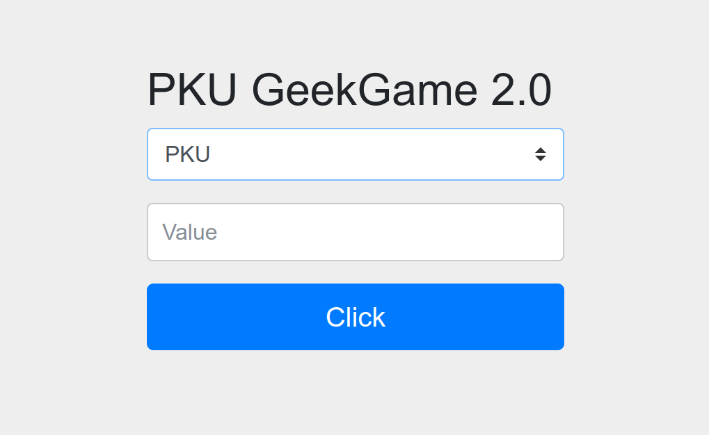

# 企业级理解

## Flag 1

访问 `/admin/` 页面，发现表单：



第一栏有三个选项：

- `PKU`
- `PKUGame`
- `PKU_GeekGame`

第二栏需要自己填写。

根据 `HTML` 源码，可以知道这个表单的动作是 `POST /admin/query`，其中第一栏的值会被作为 `type`，第二栏的值会被作为 `value`。

- 随便填一些 `value`，会被 302 到 `/login`。
- 用 `Insomnia` 发 `POST` 请求给 `/admin/query`，会卡死。不知何故。`/admin` 和 `/admin/source_bak` 也是相同情况。这三个链接都是在给出的源码里被显式加上了角色验证 `hasAnyRole()` 的。换用 `CURL`，则是直接断开。看来就是被拦截了，只是 `Insomnia` 和 `CURL` 在被拦截后的处理方式不同。
- 尝试访问 `/admin/q` 也到了和 `/admin/` 相同的页面，但这次在 `value` 一栏中有一段默认值 `404 Not Found from POST http://localhost:8079/q`。从[源码片段](./prob08-src.pdf)中我们可以知道 `8079` 是 `Backend` 运行的端口。说明我们对于 `/admin/xxx` 的请求，被转发到了后端的 `/xxx`。
- 试试看 `/admin/flag`。好吧，没这么容易拿到。
- 尝试别的方法，如 `DELETE` 等，发现转发给 `Backend` 时都变成了 `POST`。
- `POST /admin/` 时 `value` 字段的内容会自动填入。推测是 `POST http://localhost:8079/` 时，页面显示的内容就是 `value` 字段的内容。
- 试了一个新地址 `/admin/javascript:alert(2)`，`value` 字段的内容为 `Failed to resolve 'javascript:alert(2)'; nested exception is java.net.UnknownHostException: Failed to resolve 'javascript:alert(2)'`。
- `POST /admin/xxx` 时，`type` 字段填入之前没有的选项，会被加入到可选项中。猜测这样可以添加新用户，然而并非如此，或者至少新增的用户密码并不是我们填入的 `value`。

> 第二阶段提示后完成。

- 访问`/admin/source_bak/` 拿到新的一部分源码片段：

```java
import org.springframework.web.reactive.function.client.WebClient;
@RestController
public class AdminController {
  WebClient webClient =
      WebClient.builder().baseUrl("http://localhost:8079/").build();
  @RequestMapping("/admin/{index}")
  public String adminIndex(@PathVariable(name = "index") String index,
                           String auth, QueryBean queryBean) {
    if (index != null & index.contains("%")) {
      index = URLDecoder.decode(index, "UTF-8");
    }
    if (queryBean.getType() == null) {
      queryBean.setType("PKU");
    }
    if (!typeList.contains(queryBean.getType())) {
      typeList.add(queryBean.getType());
    }
    Mono str =
        webClient.post()
            .uri(index)
            .header(HttpHeaders.AUTHORIZATION, auth)
            .body(BodyInserters.fromFormData("type", queryBean.getType()))
            .retrieve()
            .bodyToMono(String.class);
    return queryBean.setValue(str.block());
  }
}
```

`POST /admin/query/` 同时令 `value=PKU_GeekGame`，得到 Flag 1：

```json
{"type":"PKU_GeekGame","value":"flag1{8a97cd0b-adec-4e63-bd46-3e6c60ea9d78} 恭喜你发现flag1，还有其他flag等待你发现哦"}
```
