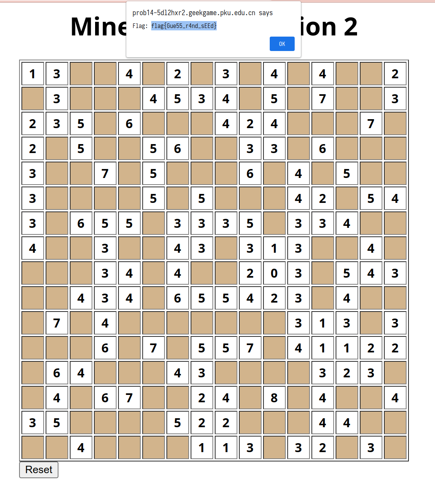

# 扫雷 II

## Flag 1

阅读源码可知，第一关的随机数生成直接使用了 `math/rand`，并且随机数种子为 `time.Now().UnixMilli()`。因为我们可以通过 `POST /reset` 控制重新生成随机数种子，因此就可以掌握到随机数种子大致的时间范围。从而，我们可以利用一次失败的尝试获取到第一次生成的 `Board`，然后暴力枚举随机数种子，这样就可以得到第二次的 `Board`，从而拿到 Flag 1。

一开始是手工一个个填的（虽然可以调用 API 但是手工填有不一样的刺激感）：

后来把几部分内容整合成了 [flag1.go](./flag1.go)。

## Flag 2

想要爆破 Flag 2，不仅需要准确时间戳，还需要一个 8 位的随机数。并且，在生成棋盘之前，预先计算了很大的位移，这就导致暴力枚举的耗时变得很长。

用求解 Flag 1 的程序测试了几次，本地发起请求的时间和实际 `reset` 的时间差大概在 10--30 ms 之间，这样把时间戳的搜索范围减小之后，用时 5 分 29 秒爆破出了结果。

代码见 [flag2.go](./flag2.go)。

## Flag 3

Flag 3 跟前两问有很大的区别，在每次生成棋盘时都调用了 `securerand`，这就导致我们无法仅通过确定时间戳（Flag 1 & 2）和初始随机值（Flag 2）来确定随机数生成器的状态。

做不出来。
